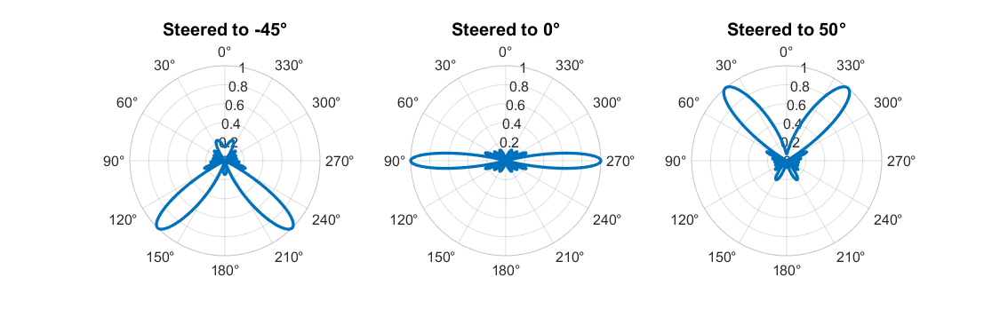
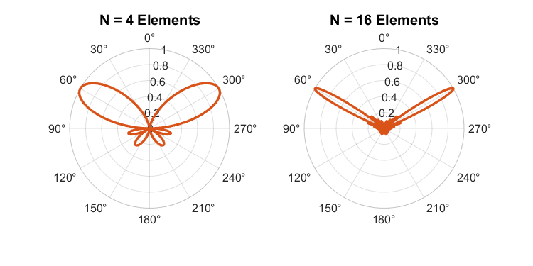

# Linear-Antenna-Array-Simulation
MATLAB computational simulation analyzing beam steering, directivity, and Array Factor (AF) in N-element linear antenna arrays.
# Linear Antenna Array Simulation

## Overview
This repository contains a MATLAB computational simulation analyzing the behavior of N-element Uniform Linear Arrays (ULA). It mathematically models and visualizes two fundamental concepts in microwave engineering and antenna theory:
1. **Electronic Beam Steering:** Modifying the progressive phase shift to direct the main lobe.
2. **Directivity and Beamwidth:** Demonstrating how increasing the number of elements ($N$) narrows the main beam and increases overall directivity.

## Mathematical Foundation
The simulation relies on the calculation of the **Array Factor (AF)**. For an N-element linear array with uniform spacing and uniform amplitude, the normalized Array Factor is given by:

$$AF = \left| \frac{\sin(N \frac{\psi}{2})}{N \sin(\frac{\psi}{2})} \right|$$

Where the total phase $\psi$ is defined as:

$$\psi = \beta d \cos(\theta) + \alpha$$

*   $\beta = \frac{2\pi}{\lambda}$ (Phase constant)
*   $d$ = Element spacing
*   $\theta$ = Observation angle
*   $\alpha$ = Progressive phase shift between elements

To steer the main beam to a desired angle ($\theta_0$), the required progressive phase shift $\alpha$ is calculated as:

$$\alpha = -\beta d \cos(90^\circ - \theta_0)$$

*Note: The limit where $\psi \to 0$ results in a $0/0$ mathematical condition, which theoretically evaluates to $1$. The MATLAB script programmatically handles this limit using `AF(isnan(AF)) = 1`.*

## Simulation Parameters
The computational script utilizes the following default parameters, modeling a standard Wi-Fi/Bluetooth ISM band scenario:
*   **Operating Frequency ($f$):** $2.4\text{ GHz}$
*   **Speed of Light ($c$):** $3 \times 10^8\text{ m/s}$
*   **Element Spacing ($d$):** $\frac{\lambda}{2}$ (Half-wavelength spacing to avoid grating lobes)

## Visual Outputs

*(Note: Run the script, save the two output figures as `steering.png` and `directivity.png`, upload them to this repository, and remove the HTML comment tags `<!-- -->` below to display them).*

### 1. Proof of Beam Steering ($N = 8$)
The script applies the phase shift equations to steer a fixed 8-element array to $-45^\circ$, $0^\circ$ (broadside), and $50^\circ$, generating comparative polar plots.

<!--  -->

### 2. Effect of Element Count on Directivity
The script fixes the steering angle at $30^\circ$ and compares the radiation pattern of a 4-element array against a 16-element array, visually proving the relationship between element count and beamwidth narrowing.

<!--  -->

## Usage
1. Clone this repository to your local machine.
2. Open the `.m` script in MATLAB.
3. Run the script. The figures will generate automatically. 
4. You can freely modify the `freq`, `angles`, and `N_values` arrays in the script to explore different array configurations.

## License
This project is open-source and available under the [MIT License](LICENSE).
